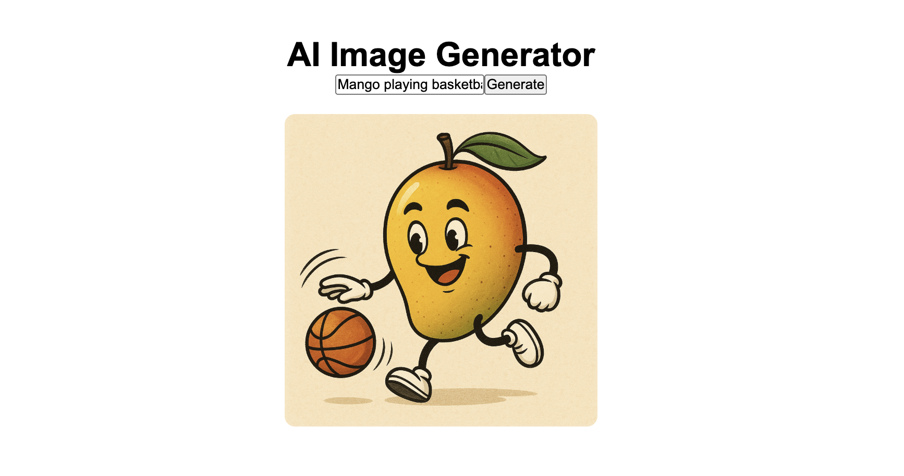

# AI Image Generator 🎨



## General Project Overview 

A full-stack web application that generates images from text prompts using the OpenAI API. This project was built to learn how to integrate and securely use an OpenAI API key in a MERN stack application.

### Tech Stack
- Frontend: React (Vite), JavaScript, HTML, CSS, REST API  
- Backend: Node.js, Express.js, CORS, dotenv (for environment variables)  
- AI Service: OpenAI API (`gpt-image-1`)

### How It Works
- User enters a text prompt
- Backend sends request to OpenAI API
- AI generates an image
- Image is returned as base64
- Frontend displays the image instantly

---

## Setup Instructions

### 1. Install dependencies

Backend:
```
cd backend
npm install
```

Frontend:
```
cd frontend
npm install
```

### 2. Add your OpenAI API key

Create a .env file inside the backend folder and add:

```
OPENAI_API_KEY=your_api_key_here
```

You can get your API key from:
https://platform.openai.com/api-keys

### 3. Run the application

Start the backend server:

```
cd backend
npm run start
```

Backend will run at: http://localhost:8080

Start the frontend:
```
cd frontend
npm run dev
```

Frontend will run at: http://localhost:5173
